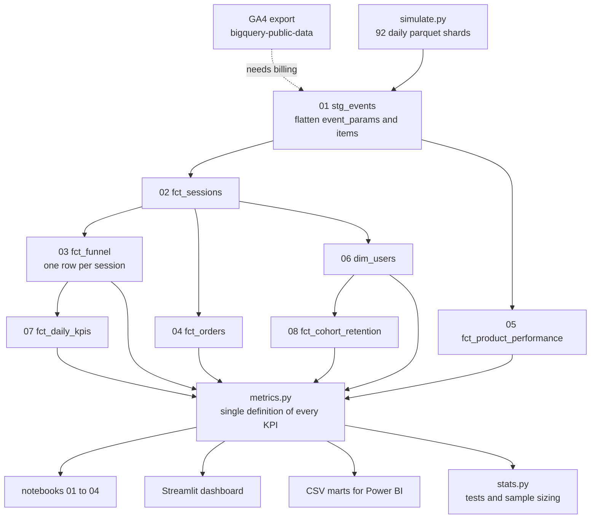

# E-commerce growth and conversion analytics engine

An end to end analytics project on a GA4 e-commerce event stream. It takes raw
event level data, builds a warehouse of eight models, measures where the funnel
breaks and for whom, tests whether the gaps are real, and turns the findings into
a sized experiment backlog.

The point is not the charts. The point is going from 2.2 million raw events to a
decision someone can act on, with the reasoning visible at every step.

## What it found

Session conversion is 1.97% across 228,210 sessions and $312,481 of revenue.
Three things stand out.

Mobile loses 9.5 percentage points more than desktop between shipping info and
payment info, 79.4% against 88.9%. It survives Holm correction (p < 0.0001) and
survives a logistic regression that controls for channel, user type, basket
price and session length. Mobile users also spend 160 seconds on that step
against 90 on desktop. Closing the gap is worth about $13,600 a quarter.

63.4% of carts never reach checkout, and that is the largest single loss in the
funnel after the product page. Abandoners and continuers view almost the same
number of products, 2.38 against 2.41, so this is not about browsing depth.

Paid social is 16.1% of acquired users and 4.0% of revenue. It adds to cart at
6.18% against 14.55% site wide, and converts at 0.53% against 1.97%. At 357
sessions a day it cannot be A/B tested to a conclusion, so this is a budget
decision rather than an optimisation problem.

Full write up in [docs/insights.md](docs/insights.md), with seven findings and
the numbers behind each one.

## The data problem, and how it is handled

The problem statement points at the public GA4 sample,
`bigquery-public-data.ga4_obfuscated_sample_ecommerce.events_*`. Querying it
needs a Google Cloud project with billing enabled, which I do not have.

So the project runs on two engines. The BigQuery SQL in `sql/bigquery/` is
written against the real public table and is the reference implementation. It
has never been executed and I am not pretending otherwise. The DuckDB SQL in
`sql/duckdb/` is a line by line port of the same eight models, running locally
on a generated event log that copies the GA4 export schema exactly, nested
`event_params` and `items` included.

That means the hard part is not skipped. The same UNNEST logic, the same
sessionisation, the same funnel definitions. Swapping in the real export is
described at the end of [docs/data_simulation.md](docs/data_simulation.md), and
nothing above the SQL layer changes.

The simulator is parameterised on behaviour, not on outcomes. I set things like
"mobile users struggle with the payment form", never "mobile converts at 1.46%".
Every rate in this repo is an output.

## Architecture



Everything downstream of the warehouse calls `metrics.py`, so a number cannot
mean one thing in a notebook and something else on a dashboard.

## Running it

Needs Python 3.11 or later. No GPU, no cloud account.

```powershell
python -m venv .venv
.\.venv\Scripts\Activate.ps1
pip install -r requirements.txt

python run_pipeline.py --all
```

That generates the raw events, builds the warehouse and writes the CSV marts.
It takes a couple of minutes and produces about 40 MB of parquet in `data/raw/`
plus a DuckDB file in `data/warehouse/`.

Then any of:

```powershell
pytest -q
jupyter lab notebooks
streamlit run dashboard/app.py
```

Individual stages: `--simulate`, `--build`, `--marts`.

## What is in here

| Path | What it is |
| --- | --- |
| `sql/bigquery/` | The eight models as they would run on the real GA4 export |
| `sql/duckdb/` | The same eight models ported to DuckDB, with the deviations noted in comments |
| `src/ga4_growth/simulate.py` | Generates a GA4 schema faithful event log |
| `src/ga4_growth/warehouse.py` | Runs the models in order, gives back a query helper |
| `src/ga4_growth/metrics.py` | Every KPI, defined once |
| `src/ga4_growth/stats.py` | Proportion tests, Holm correction, Wilson intervals, bootstrap, power analysis |
| `src/ga4_growth/viz.py` | Chart helpers so the notebooks stay readable |
| `notebooks/01` | Data quality, revenue reconciliation, headline KPIs, promo week |
| `notebooks/02` | Funnel by device, channel, user type, price band, country, category |
| `notebooks/03` | Acquisition quality, cohort retention, lifecycle segments, product Pareto |
| `notebooks/04` | Significance tests, chi square, logistic regression, experiment sizing |
| `dashboard/app.py` | Five page Streamlit app on the same metrics layer |
| `powerbi/` | Load instructions and a DAX measure file for the same marts |
| `docs/` | Insights, metric definitions, experiment backlog, simulation notes, limitations |
| `tests/` | Funnel monotonicity, model parity, KPI ranges, uniqueness, stats sanity |

## Documentation

[docs/insights.md](docs/insights.md) is the analysis write up, seven findings
with the numbers.

[docs/experiment_backlog.md](docs/experiment_backlog.md) turns them into five
experiments, each with a primary metric, guardrails, a detectable effect size
and the number of days it needs at observed traffic. Two of the five are honest
about not fitting in a usable window.

[docs/metric_definitions.md](docs/metric_definitions.md) defines every metric,
its grain, and the ways it can be misread.

[docs/data_simulation.md](docs/data_simulation.md) covers the generating model
and how to swap in the real export.

[docs/limitations.md](docs/limitations.md) is what would change the conclusions,
including the fact that none of this is causal and that promo week distorts
every headline number.

## Choices worth explaining

The funnel is measured on sessions, not users. A user who browses on Monday and
buys on Thursday has two sessions and one conversion. That is the right grain for
asking where a checkout flow breaks and the wrong one for asking how long people
take to decide, which is why days to first purchase is reported separately.

Funnel steps are cumulative. A session counted at begin checkout is also counted
at add to cart even if the events arrived out of order, which GA4 does regularly.

Channel is first touch. That flatters top of funnel channels and punishes
closers, and it is the right model for the question of which channel to buy more
users from. It would be the wrong model for a mid funnel question.

Every multi segment comparison is Holm adjusted. On six channels, an unadjusted
test calls something significant by chance about a quarter of the time.

Effect size is reported next to every p value. The chi square on device against
funnel step gives p = 7.9e-112 and Cramer's V = 0.035, which is a very weak
association on a very large sample. The p value is not the interesting number.
# E-commerce-Growth-and-Conversion-Analytics-Engine
# E-commerce-Growth-and-Conversion-Analytics-Engine
# E-commerce-Growth-and-Conversion-Analytics-Engine
# E-commerce-Growth-and-Conversion-Analytics-Engine
